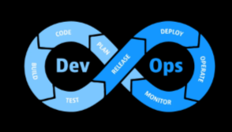
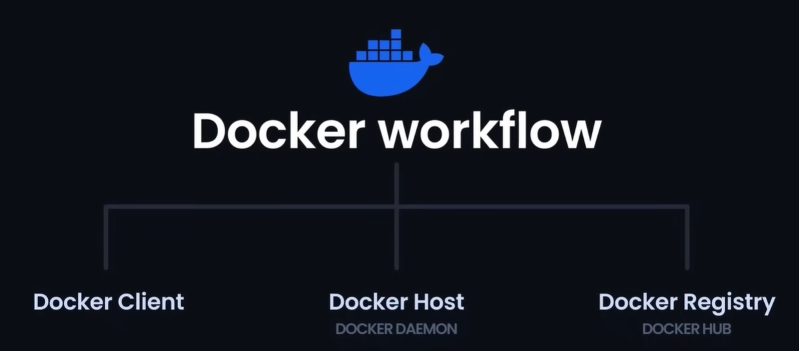
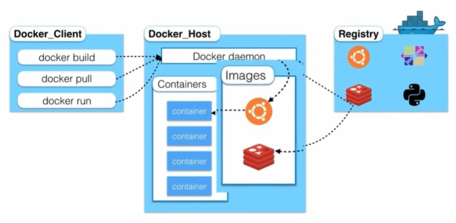
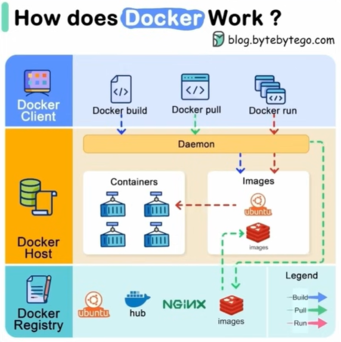
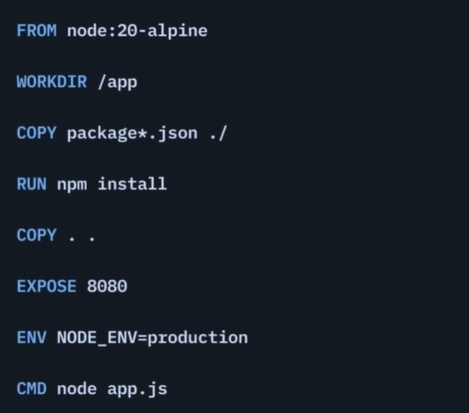

# DevOps - Beginners

> Code is the dough and build is the bread.

## Version Control

### Question
What is the difference between `git cherry-pick`, `git revert`, and `git reset`?

### Answer

#### 1. `git reset` — The Eraser
- Moves your current branch pointer backward.
- Removes commits from history in your local repository.
- Best used for fixing local mistakes before sharing your work.

**Analogy:** Ripping a few faulty pages completely out of your diary.

#### 2. `git revert` — The Safe Undo
- Creates a new commit that reverses the changes of a previous commit.
- Does not remove history.
- Best used for undoing an error on a shared public branch like `main` without rewriting history.

**Analogy:** Writing a new diary entry that says, "Ignore everything I wrote yesterday; it was a mistake."

#### 3. `git cherry-pick` — The Copy-Paste
- Applies a single commit from another branch onto your current branch.
- Keeps history intact and does not move branch pointers.
- Best used to bring a specific bug fix or feature from another branch without merging all of its changes.

**Analogy:** Seeing a great paragraph in someone else's book, photocopying it, and pasting it into your own book.

## CI/CD Pipelines

`YAML` stands for "YAML Ain't Markup Language." In CI/CD, indentation matters.

### Core actions and keywords
- `name` — defines a workflow or job title.
- `on` — defines triggers such as `push`, pull request, or schedule.
- `jobs` — defines one or more jobs.
- `steps` — defines sequential commands or actions.
- `run` — executes shell commands.
- `uses` — uses prebuilt actions.
- `with` — passes parameters into actions.
- `env` — sets environment variables.
- `needs` — makes one job dependent on another.

## Docker

Docker ensures consistency across applications. It can run on any OS and any system, reducing confusion and improving development efficiency. Docker maintains isolation and portability, making it easy to move applications between development, staging, and production. Docker also helps track application versions and bridges the gap between development and operations.

### Key Docker concepts
- `Images` — lightweight, standalone executable packages.
- `Containers` — runtime instances created from images, containing everything needed to run the application.

**Analogy:** A Docker image is a recipe, and a container is the dish.

You can create a single Docker image and run many instances of it.

### Docker Volume
A `Docker Volume` is a persistent data storage mechanism that allows data to be shared between a container and the host machine.

**Analogy:** Think of it as a shared folder that exists outside the container.

### Docker Network
A `Docker Network` is a communication channel that allows containers to talk to each other and to the outside world while maintaining isolation.

### Docker components
- `Docker Client` — the chef giving instructions to the kitchen staff.
- `Docker Host/Daemon` — oversees requests, creates and manages containers, and builds images.
- `Docker Hub` — a centralized repository of Docker images.

## Creating Our Own Docker Image

### Dockerfile instructions
- `FROM` — specifies the base image. It is like starting with a kitchen that has the required ingredients.
- `WORKDIR` — sets the working directory inside the image.
- `COPY` — copies files from the build context into the image.
- `RUN` — executes commands during image build.
- `EXPOSE` — informs Docker which port the container will listen on.
- `ENV` — sets environment variables at build time.
- `ARG` — defines build-time variables.
- `VOLUME` — specifies mount points for external storage.
- `CMD` — defines the default command to run when the container starts. It is flexible and can be overridden.
- `ENTRYPOINT` — defines the fixed executable when the container starts.

### Docker port metadata vs actual port

- `EXPOSE 3000` is metadata only.
- It documents the port the image is expected to use.
- It does not make the app listen on that port.
- It does not publish the port to the host.

Actual port behavior:
- the app inside the container must listen on a port (for example, Vite default `5173` or configured `3000`)
- Docker can map a host port to the container port using `-p`, for example `docker run -p 3000:3000`

I was trying to run vite which used default port 5173, i exposed 3000 in dockerfile but didnt work:
- Vite was starting on `5173`
- the app was listening on container port `5173`
- `EXPOSE 3000` did not change that
- to run on `3000`, configure Vite to use port `3000` and run the container with `-p 3000:3000`

...